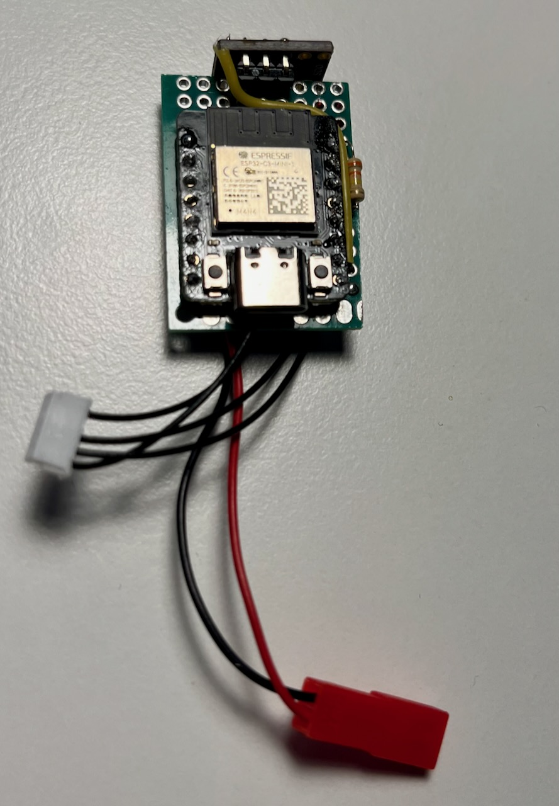
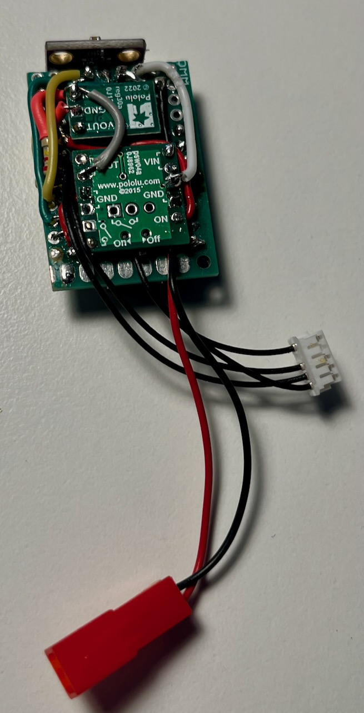
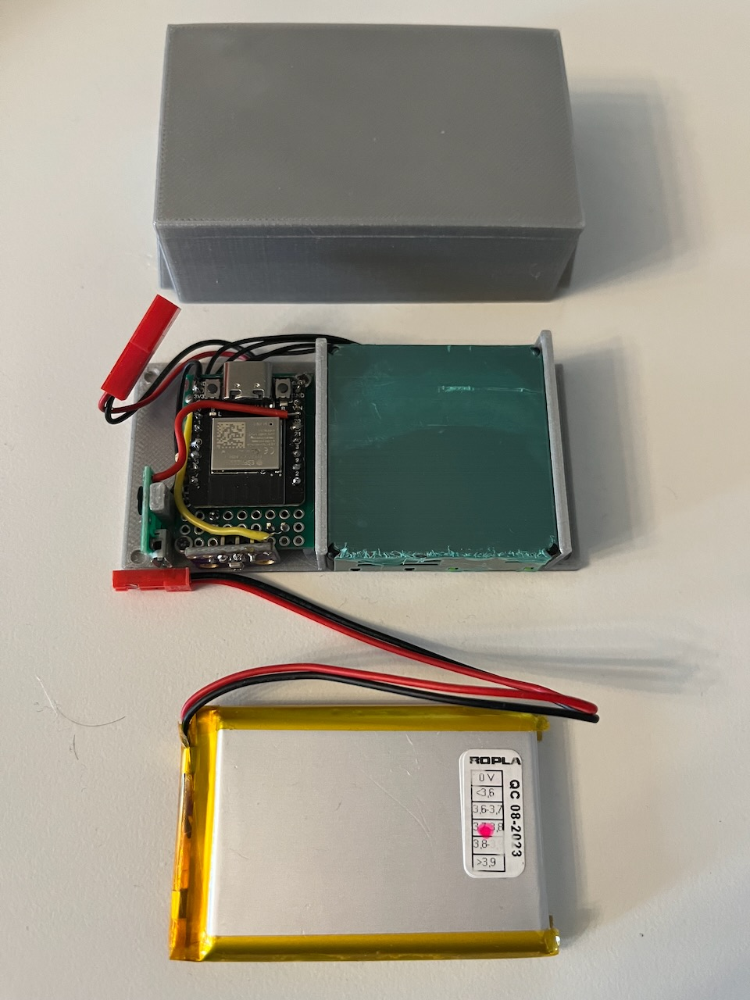

## Schematics

All electronic components except SPS30 and Li-Pol are soldered to the prototype board.
To fit inside the case the board shall be cut from the top right corner to leave 9x12 soldering holes area and one mounting hole.

The Beetle C3 controller is soldered on top close to rear side. BME280 module is soldered vertically using L-shape pins at the front side.
Switch and step-up modules are soldered at the bottom. The connections are made using thin insulated wires.

- SPS30 sensor connection cable:
    - `VCC` is connected to the +5V output of the step-up converter
    - `RX`  is connected to the `IO21` on the Beetle C3
    - `TX`  is connected to the `IO20` on the Beetle C3
    - `SEL` is not connected
    - `GND` is connected to the `GND` on the switch module
- BME280 connection:
    - `SDA` is connected to the `IO1` on the Beetle C3
    - `SCL` is connected to the `IO0` on the Beetle C3
    - `GND` is connected to the `GND` on the switch module
    - `VCC` is connected to the `3V3` output on the Beetle C3
- Pololu 2810 switch connection:
    - `GND` 1 of 4 holes is connected to the GND pin of the C3 board, the others and used as the ground for the other parts
    - `On` is connected to the IO7 pin of the Beetle C3 board
    - `VIN` is connected to the Vbat of the Beetle C3 board
    - `VOUT` one hole is connected to the + input of the step-up converter. The second hole is connected to voltage divider (R1=220k, R2=330k) with the middle point's connected to the `IO4` pad of the Beetle C3.
- step-up converter connection:
    - `Vin` hole is connected to the VBAT pin of the Lolin32-lite board
    - `GND` hole is connected to the GND pin of the Lolin32-lite board
    - `Vout` hole is connected to the VCC pin of the SPS30 sensor.
- microUSB socket connection:
  - 'GND' to the 'GND' pad of the Beetle C3
  - 'VCC' to the 'Vin' pad of the Beetle C3

The stl files:

[PMSensorFrameExternalDFRobot.stl](PMSensorFrameExternalDFRobot.stl) - main frame

[PMSensorCoverExternalDFRobot.stl](PMSensorCoverExternalDFRobot.stl) - external cover

## The assembled device:

The top view on main assembly:

The bottom view on main assembly:

Pre-assembled parts
