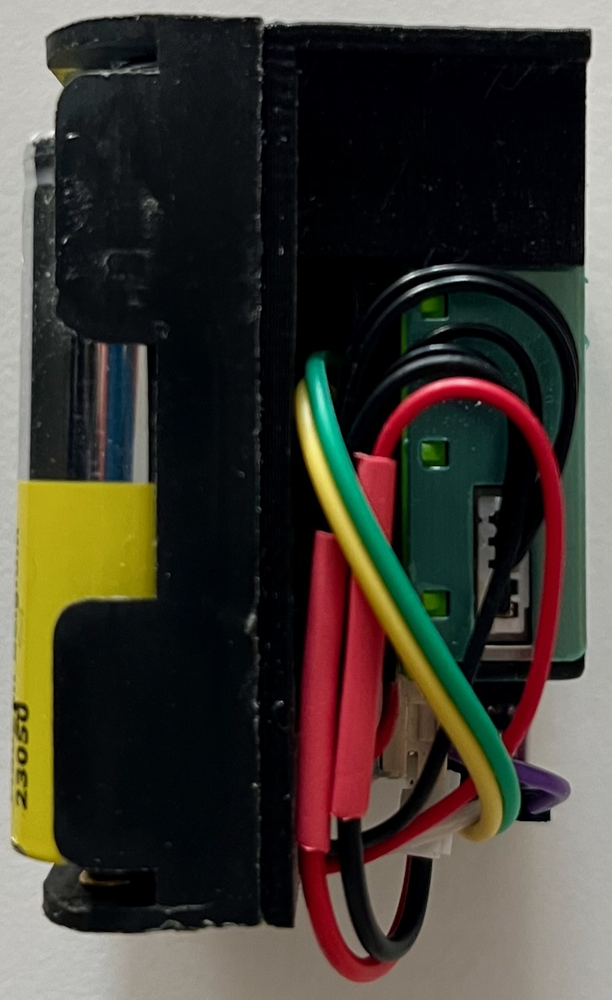
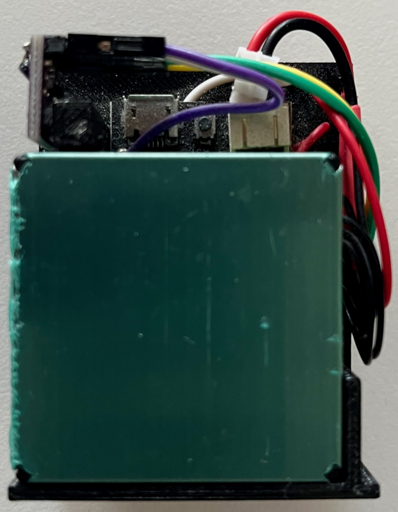
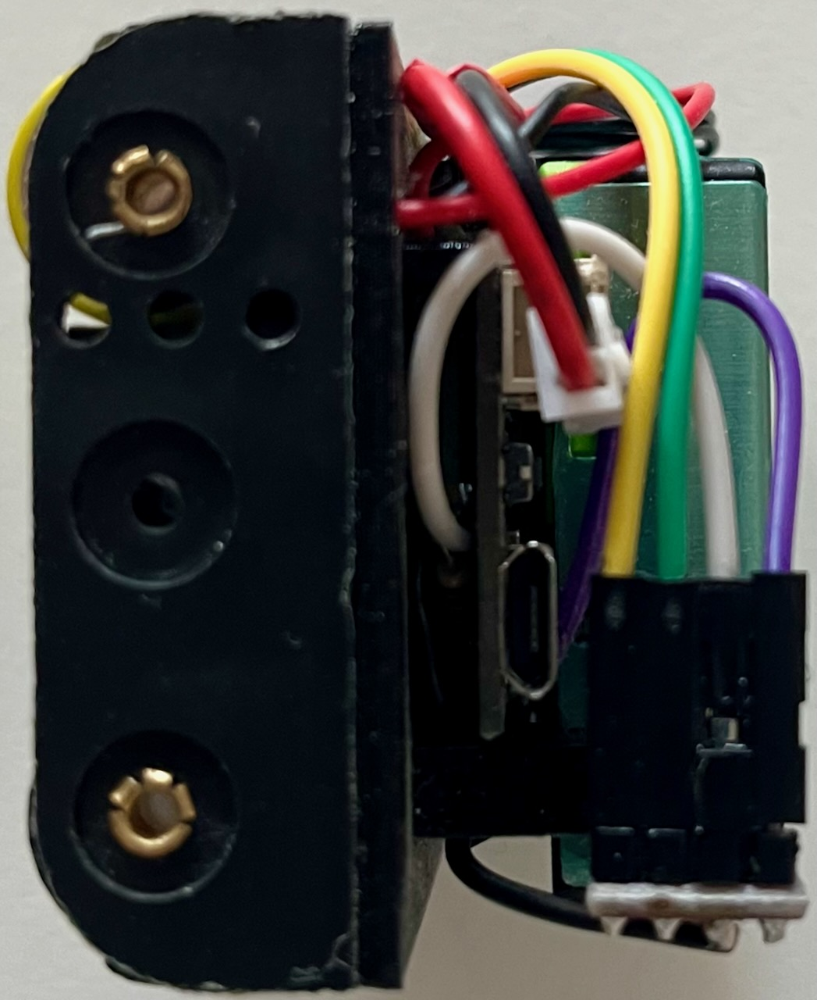

## Schematics

- SPS30 sensor is connected to the UART2 port of the Lolin32-lite board.
    - `VCC` pin of the sensor is connected to the +5V output of the step-up converter
    - `RX` pin of the sensor is connected to the `IO27` pin of the board
    - `TX` pin of the sensor is connected to the `IO26` pin of the board
    - `SEL` pin of the sensor is not connected
    - `GND` pin of the sensor is connected to the `GND` pin of the board
- BME280 module is connected to the I2C port of the Lolin32-lite board
    - `SDA` pin of the sensor is connected to the `IO33` pin of the board
    - `SCL` pin of the sensor is connected to the `IO32` pin of the board
    - `GND` pin of the sensor is connected to the `GND` pin of the board
    - `VCC` pin of the sensor is connected to the `3V3` pin of the board
- Pololu 2810 switch is mounted _under_ the main board and handled by pass-through pins:
    - `GND` connected to the GND pin of the board
    - `Enable` pin connected to the IO12 pin of the Lolin32-lite board (next to the GND pin)
    - `VIN` pin connected to the battery+ of the Lolin32-lite board
    - `VOUT` pin connected to the + input of the step-up converter.  Addtionally, it's connected to voltage divider (R1=220k, R2=330k) and the output of the divider is connected to the `IO2` pin of the board. This pin is used to measure the battery voltage.
- step-up converter's is fixed into separated place on the frame
    - `+` input is connected to the VBAT pin of the Lolin32-lite board
    - `-` input is connected to the GND pin of the Lolin32-lite board
    - `+` output is connected to the VCC pin of the SPS30 sensor.

## Scematics

[external sensor cover](external_sensor_cover.stl)

[external sensor frame](external_sensor_frame.stl)

## The assembled device:

The side view:

The top view:

The connectors' side view:
